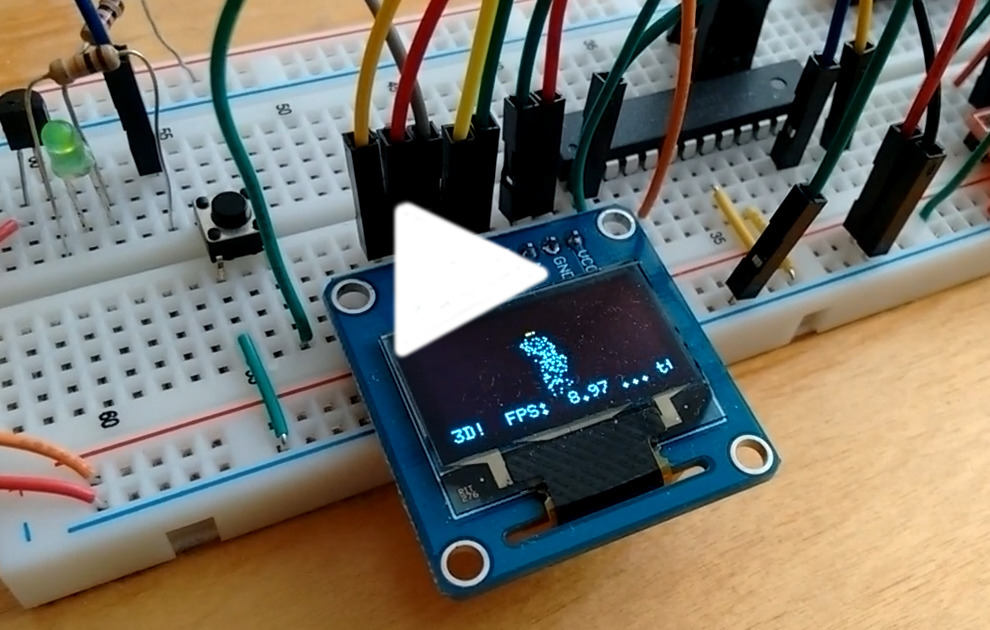

I've been fooling around with SW-only 3D graphics
[for quite some time](https://www.thanassis.space/renderer.html).
Since I've been recently playing with an ATmega328P microcontroller,
I decided to try to implement "points-only" 3D rendering - and have
the code drive an OLED display via the SPI interface...  at the
magnificent resolution of 128x64 :-)

Points of note:

- Fixed point calculations, of course (8 bits for the fractional part)
- I stored and read the statue data from the .text segment. Even though
  the ATmega328P has 32KB of flash available to store the program code,
  it only has 2K of RAM. So the flash stores not only the code, but also
  the constant (read-only) data of the X,Y and Z coordinates of the points.
- The "design" has a bonus "distance LED" indicator: shining brightly when
  the statue gets close :-)
- The code conditionally outputs frames per second (FPS) information over
  the ATmega328P's serial port.

SPI was used in two places: the ATmega328P drives the OLED via its SPI pins,
but additionally, the micro-controller itself is programmed via the same SPI
pins through a Raspberry PI2 SPI interface. The PI sits next to the breadboard,
where I run <a href="contrib/avrdude_gpio.conf.patch">avrdude</a> to flash
the code. And yes, that means that the SPI pins are shared - either driven
by the PI or by the ATmega (but not at the same time).

I thoroughly enjoyed playing with HW again - this was fun :-)

UPDATE: De-soldered the BS1 SMD resistor, and switched the screen to I2C
mode. In the end, I like the simplicity of I2C.
